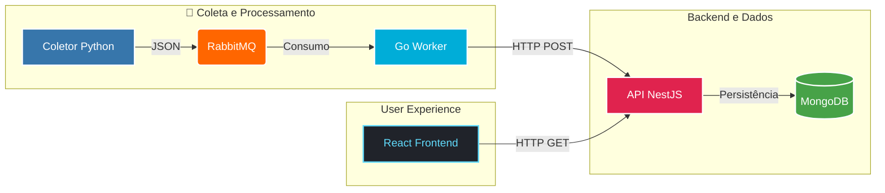

# 🌍 Nexus Clima PRO

> **Plataforma de monitoramento climático em tempo real com arquitetura distribuída de alta performance.**


<br>


O **Nexus Clima** nasceu como um desafio técnico de backend, mas evoluiu para um **SaaS (Software as a Service)** completo. O objetivo foi transformar uma arquitetura complexa de microsserviços em uma experiência fluida para o usuário final, integrando **Desktop e Mobile** em tempo real.

O projeto demonstra a maturidade de sair da teoria para a prática, unindo a velocidade do Go, a robustez do NestJS e a interatividade do React/PWA.

---

## A Experiência Nexus

A interface foi desenhada com foco total em UX/UI, utilizando **Glassmorphism** e transições fluídas.

<div align="center">
  
</div>

---

## Arquitetura de Microsserviços

O sistema opera em um fluxo de dados desacoplado, garantindo resiliência e escalabilidade:



---

| Serviço | Responsabilidade | Stack Tecnológica |
| :--- | :--- | :--- |
| ** Worker Python** | Coleta dados meteorológicos da Open-Meteo a cada 30 min. | `Python 3.12`, `Requests` |
| ** Message Broker** | Gerencia filas e garante a entrega das mensagens. | `RabbitMQ` (AMQP) |
| ** Processor Go** | Consome a fila com alta concorrência e envia ao backend. | `Go` (Golang) 1.23 |
| ** Core API** | Regras de negócio, Insights de IA e Gestão de Dados. | `NestJS`, `TypeScript` |
| ** Database** | Armazenamento escalável de histórico e usuários. | `MongoDB` |
| ** Frontend** | Dashboard reativo, Temas Dinâmicos e Avatar 3D. | `React`, `Shadcn/UI`,`Tailwind` |

---

## Funcionalidades "PRO"

O Nexus vai além do básico, oferecendo recursos premium:

* **🤖 Avatar Climático Inteligente:** Um personagem 3D que reage ao clima e horário (usa óculos de sol, casaco ou pijama), criando conexão emocional com o usuário.
* **🎨 Temas Dinâmicos:** O sistema detecta o contexto (Tempestade, Calor, Noite) e adapta toda a paleta de cores da interface automaticamente.
* **🌍 Pesquisa Global Híbrida:** Consulte o clima de qualquer lugar do mundo sem poluir o banco de dados local (estratégia de Cache vs Persistência).
* **🧠 Insights com Personalidade:** Esqueça a previsão do tempo chata. O sistema analisa os dados e gera frases inteligentes (e as vezes engraçadas) para tornar o monitoramento mais leve, unindo dicas úteis com uma pitada de humor.
* **⚡ Pontualidade & Performance:** Relógio "Vivo" que se sincroniza matematicamente com o fuso horário (Timezone) de qualquer cidade pesquisada, garantindo que o usuário saiba exatamente a hora local do outro lado do mundo.
* **📱 Integração Mobile (Scan & Go):** Recurso de Handoff que permite transferir a sessão do PC para o celular instantaneamente via QR Code, com interface 100% otimizada para toque.

## Como Rodar (Docker)

O projeto é **100% Dockerizado**. Para rodar, você só precisa ter o Docker instalado.

### 1. Clone o Repositório
```bash
git clone [https://github.com/Tiagliveira/nexus-clima.git](https://github.com/Tiagliveira/nexus-clima.git)
cd nexus-clima

docker-compose up --build -d
```
---

### Autor
Tiago Oliveira